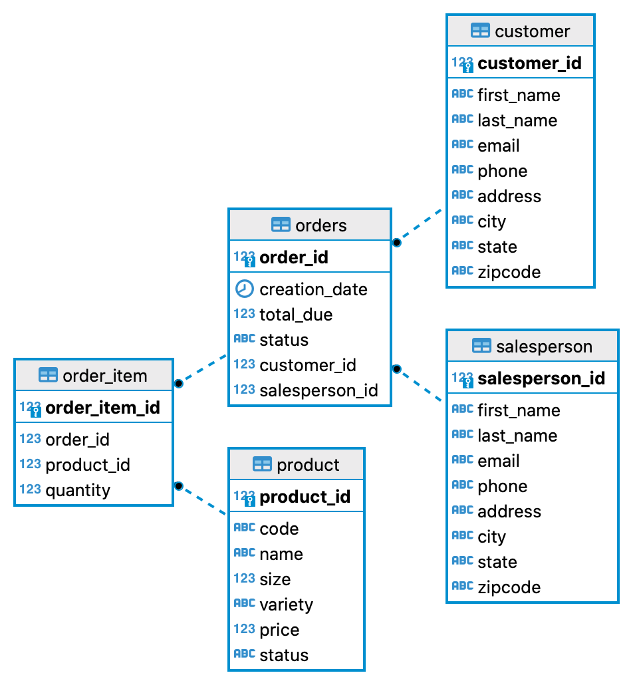

# Introduction
The JDBC APP manages data in a relational database by using CRUD (Create, Read, Update, Delete) operations. It shows how to use Java Database Connectivity(JDBC) API with a Postgres database. The Data Access Object (DAO) Pattern is used to communicate with the database and Maven is used to manage the project.
# Implementaiton
## ER Diagram

## Design Patterns
DAO is an abstraction of data persistence and is considered closer to the underlying storage, which is often table-centric. However, a repository is an abstraction of a collection of objects
DAO is a lower-level concept, closer to the storage systems. However, Repository is a higher-level concept, closer to the Domain objects
DAO works as a data mapping/access layer, hiding ugly queries. However, a repository is a layer between domains and data access layers, hiding the complexity of collating data and preparing a domain object
DAO can't be implemented using a repository. However, a repository can use a DAO for accessing underlying storage.
If we have an anemic domain, the repository will be just a DAO.
DAO seems a perfect candidate to access the data, and a repository is an ideal way to implement a business use-case. The repository pattern encourages a domain-driven design, providing an easy understanding of the data structure for non-technical team members.
# Test
The Postgres database is set up by docker and is initialized by SQL files. Tests are done manually based on the online course.
