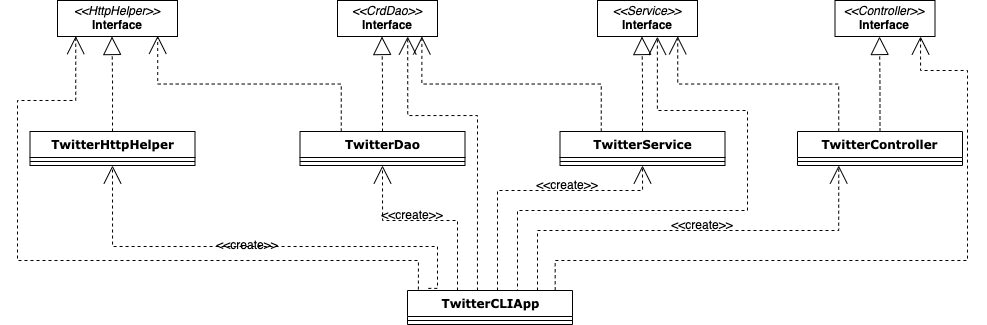

# Introduction
This Java Twitter application allows users to search, post, and delete Tweets via official Twitter REST APIs. Using the MVC architecture (without V), it explores the classic implementation of using a REST API and the optimization by the use of SpringBoot.
Technologies used: Twitter REST API, HTTP client, mvn, Java libs, docker, PostMan, SpringBoot.

# Quick Start
- how to package your app using mvn?
    `mvn clean package`
- how to run your app with docker?
    ```docker run --rm  -e consumerKey={your_consumer_key}  -e consumerSecret={your_consumer_secret}  -e accessToken={your_access_token} -e tokenSecret={your_token_secret} natsumeqi/twitter_app post|show|delete [options]```
# Design
## UML diagram

## App/main explain each component(app/main, controller, service, DAO) (30-50 words each)
The TwitterCLIApp class declare and instantiate all components (controller, service, DAO, TwitterHttpHelpler) and call run method which calls controller methods and print tweet(s).
## Controller

The controller layer interacts and parsers user input (CLI args in this APP) and also calls the service layer and returns results. It does not handle any business logic.

## Service Layer

  The service layer handles business logic and calls DAO layer in order to interact with the underlying storage/service which is the Twitter REST API in this app.

## Data Access Layer (or DAO/DAL)

  The data access layer handles models (implemented with POJOs). In this app, the DAO layer create/show/delete tweet(s).
## Models

  Models are implemented with POJOs which is a class with private member variables and public getter and setters. This class encapsulates Tweet data ([Tweet Objects](https://developer.twitter.com/en/docs/tweets/data-dictionary/overview/intro-to-tweet-json)) which is often displayed in JSON format.

  In this application, we use the same Tweet model as Data Transfer Model (or DTO) and Data access model (or domain model).

The Tweet object contains other objects, including Entities(Hashtag, UserMention), and Coordinates.

## Spring
- @Beans 

This approach is implemented as TwitterCLIBean class. It defines dependency relationship using @Bean and passes dependencies through method arguments. Then it creates an IoC container/context which will automatically instantiate all Beans base on the relationship you specified in the previous step. At last, it gets the main entry point (TwitterCLIApp) from the IoC container and starts the program. 
- @ComponentScan 

This approach is implemented as TwitterCLIComponentScan class. It uses @Autowired annotation to tell IoC container to inject dependency through the constructor.
- SpringBoot 

This approach is implemented as TwitterCLISpringBoot class. The class implements the CommandLineRunner interface which requires implementing a run method.
# Test

Junit is used in the corresponding integration tests. It involves the tested classes and their dependencies (a group of classes or components).
JUnit and Mockito are used in the corresponding unit tests. It tests a class but not the dependencies. You can make a mock object of the dependency class and have control on what the dummy object will return. 
## Deployment
After packaging the App, a new docker image can be created locally based on the Dockerfile which specifies the configuration of how to run the App.

# Improvements
- Better secret tokens management
- Future front-end input
- More exception handling