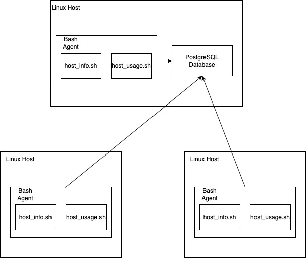

# Linux Cluster Monitoring Agent
# 
# Introduction
This Linux/SQL project helps the Jarvis Linux Cluster Administration (LCA) team better manage a Linux cluster of 10 hosts which can communicate with each other through internal IPv4  by using a switch. These hosts are running CentOS 7, and the project uses Docker to create a container to simplify the setup for the PostgreSQL database.

The scripts collect the hardware specifications, monitor host resource usages, e.g. CPU/Memory every minute and store the information into a database which is installed in one host. The LCA team can then query the database to know the running situation of the cluster and generate reports for future decisions.

Technologies used: Linux, Bash, SSH, Docker, PostgreSQL, Git, IntelliJ IDEA.

# Quick Start
- Start a psql instance using psql_docker.sh

  ```bash
  [PATH to scripts/psql_docker.sh] start|stop|create [db_username][db_password]
  ```

- Create tables using ddl.sql

  ```bash
  psql -h [db_host] -U [db_username] -d [db_name] -f [PATH to sql/ddl.sql]
  #Example:
  psql -h localhost -U postgres -d host_agent -f ./sql/ddl.sql
  ```

- Insert hardware specs data into the DB using host_info.sh

  ```bash
  [PATH to /scripts/host_info.sh] [db_host] [db_port]  [db_name] [db_username] [db_password]
  ```

- Insert hardware usage data into the DB using host_usage.sh

  ```bash
  [PATH to /scripts/host_usage.sh] [db_host] [db_port] [db_name] [db_username] [db_password]
  ```

- Crontab setup

  ```bash
  #edit crontab jobs
  bash> crontab -e
  
  #add this to crontab
  * * * * * bash [PATH to /linux_sql/host_agent/scripts/host_usage.sh] [db_host] [db_port] [db_name] [db_username] [db_password] > /tmp/host_usage.log
  ```

# Implemenation
This project is in the form of MVP (Minimum viable product) for learning and training. Hence, the Bash scripts and SQL scripts are installed in one host to demonstrate the results.

## Architecture



## Scripts

The password (12345678) below is only to show examples.

- psql_docker.sh

  This script can create, start or stop the PostgreSQL container provisioned by Docker.

  ```bash
  [PATH to scripts/psql_docker.sh] start|stop|create [db_username][db_password]
  #Example:
  ./scripts/psql_docker.sh start postgres 12345678
  ./scripts/psql_docker.sh stop postgres 12345678
  ./scripts/psql_docker.sh create postgres 12345678
  ```

- host_info.sh

  This script collects the host hardware specification and stores it in the database. Please run it only once.

  ```bash
  [PATH to /scripts/host_info.sh] [db_host] [db_port]  [db_name] [db_username] [db_password]
  #Example:
  ./scripts/host_info.sh localhost 5432 host_agent postgres 12345678
  ```

- host_usage.sh

  This script monitors the CPU and memory in real-time and stores it in the database.

  ```bash
  [PATH to /scripts/host_usage.sh] [db_host] [db_port] [db_name] [db_username] [db_password]
  #Example:
  ./scripts/host_usage.sh localhost 5432 host_agent postgres 12345678
  ```

- crontab

  Crontab schedules the monitoring job by triggering host_usage.sh every minute.

  ```bash
  #edit crontab jobs
  bash> crontab -e
  
  #add this to crontab
  * * * * * bash [PATH to /linux_sql/host_agent/scripts/host_usage.sh] [db_host] [db_port] [db_name] [db_username] [db_password] > /tmp/host_usage.log
  #Example:
  * * * * * bash /home/centos/dev/jarvis_data_eng_Jesse/linux_sql/host_agent/scripts/host_usage.sh] localhost 5432 host_agent postgres 12345678 > /tmp/host_usage.log
  ```

- queries.sql (describe what business problem you are trying to resolve)

  This query file will be run to acquire information for the following questions:

  1. Sort all the hosts by CPU number and their memory size so the overview of the cluster can easily be provided to LCA manager.
  2. Get the report of average used memory in percentage over 5 mins intervals for each host so LCA manager can examine the situations for each host.
  3. Get an alert when there is a record showing that less than three data points insert into the database within a 5-min interval, meaning a host may stop working.

## Database Modeling
The schema of each table:
- `host_info`

  | Data Column      | Meaning                     |
  | ---------------- | --------------------------- |
  | id               | host identification         |
  | hostname         | fully qualified hostname    |
  | cpu_number       | the number of the CPU       |
  | cpu_architecture | the architecture of the CPU |
  | cpu_model        | the model of the CPU        |
  | cpu_mhz          | CPU speed in MHZ            |
  | L2_cache         | L2 cache size in KB         |
  | total_mem        | total memory in KB          |
  | timestamp        | current time in UTC         |

- `host_usage`

  | Data Column    | Meaning                        |
  | -------------- | ------------------------------ |
  | timestamp      | current time in UTC            |
  | host_id        | host identification            |
  | memory_free    | free memory in MB              |
  | cpu_idle       | CPU in idle in percentage      |
  | cpu_kernel     | CPU in kenel in percentage     |
  | disk_io        | number of disk I/O             |
  | disk_available | root directory available in MB |

# Test
How did you test your bash scripts and SQL queries? What was the result?

The tests on Bash scripts and SQL queries are done manually. Some sample data are inserted into the database to simulate the cluster environment. Also, IntelliJ ultimate database tool is used to better verify the results of queries.

For example, to test the first query, the following data is inserted into the database first.

```sql
INSERT INTO host_info( id, hostname, cpu_number, cpu_architecture, cpu_model, cpu_mhz, L2_cache, total_mem, timestamp) VALUES 
( 2, 'name2', 1, 'x86', 'intel', 2000, 256, 2048, '2019-05-29 15:00:00.000' ), 
( 3, 'name3', 2, 'x86', 'intel', 2000, 256, 2048, '2019-05-29 15:00:00.000' ), 
( 4, 'name4', 2, 'x86', 'intel', 2000, 256, 4088, '2019-05-29 15:00:00.000' ), 
( 5, 'name5', 1, 'x86', 'intel', 2000, 256, 1568, '2019-05-29 15:00:00.000' ), 
( 6, 'name6', 2, 'x86', 'intel', 2000, 256, 1024, '2019-05-29 15:00:00.000' ), 
( 7, 'name7', 1, 'x86', 'intel', 2000, 256, 1024, '2019-05-29 15:00:00.000' ); 


```

Then run the SQL query, and we can have the following results:

| cpu_number | host_id | total_mem |
| ---------- | ------- | --------- |
| 1          | 2       | 2048      |
| 1          | 5       | 1568      |
| 1          | 7       | 1024      |
| 2          | 1       | 8005716   |
| 2          | 4       | 4088      |
| 2          | 3       | 2048      |
| 2          | 6       | 1024      |

The results are sorted by CPU number and memory size in descending order.

# Deployment
The bash script for monitoring the host is scheduled by crontab. The project is hosted on Github. The PostgreSQL instance is provisioned by Docker.

# Improvements
- Handle future hardware updates to automatically change the information in the database.
- Add more test cases.
- Add more SQL queries to meet the need of the LCA team.
