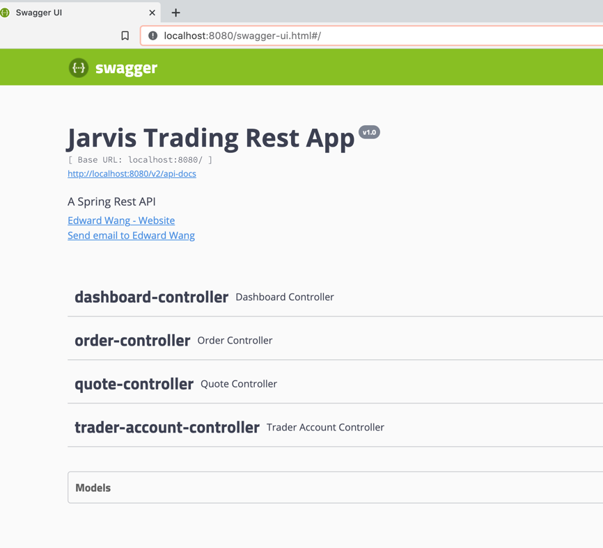
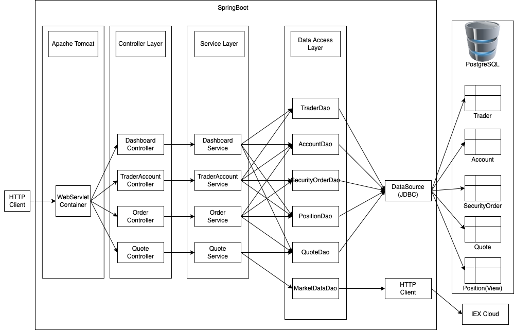
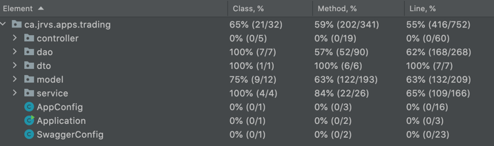
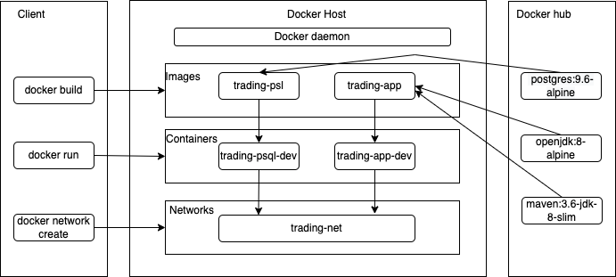

Table of contents
* [Introduction](#Introduction)
* [Quick Start](#Quick-Start)
* [Implementation](#Implementation)
* [Test](#Test)
* [Deployment](#Deployment)
* [Improvements](#Improvements)

# Introduction
This SpringBoot project is a new trading system which aims to replace the legacy monolithic application that is hard to scale and manage. The trading platform is a REST API that allows users to manage client profiles and accounts, execute security orders, etc. It uses Java 8 and SpringBoot to implement the REST API and a PostgreSQL database to store all data including traders, accounts, quotes and security orders. Also, it fetches free market data (stock price) from an IEX Cloud service via the external REST API. Integration tests set up by JUnit are used to test major components. Swagger and postman are also used to test the REST endpoints. The application is built and managed by Maven and deployed using Docker. One PostgreSQL container and one SpringBoot application container are created.


# Quick Start
- Prerequisites: Docker
  - build images
    1. PSQL image:
    Use the dockerfile under the folder psql to build the PSQL image.
    ```
    cd ./springboot/psql
    docker build -t trading-psl
    ```
      
    2. APP image:
    Use the dockerfile under the folder springboot to build the APP image. 
    ```
    cd ./springboot
    docker build -t trading-app
    ```

  - create a docker network

    ```
    docker network create trading-net
    ```

  - start containers
  
    ```
    docker run --name trading-psql-dev  -e POSTGRES_PASSWORD=password  -e POSTGRES_DB=jrvstrading  -e POSTGRES_USER=postgres  --network trading-net  -d -p 5432:5432 trading-psl
    ```
    ```
    export IEX_PUB_TOKEN={your IEX public token}
    docker run --name trading-app-dev  -e "PSQL_URL=jdbc:postgresql://trading-psql-dev:5432/jrvstrading"  -e "PSQL_USER=postgres"  -e "PSQL_PASSWORD=password"  -e "IEX_PUB_TOKEN=${IEX_PUB_TOKEN}"  --network trading-net  -p 8080:8080 -t trading-app
    ```

  - Try trading-app with SwaggerUI (screenshot)
  


# Implemenation
## Architecture
- component diagram 

- Controller layer 
  The Controller layer handles HTTP requests. There are four controllers: DashboardController, OrderController, QuoteController and TraderAccountController. Based on the HTTP request URL and method, different controller methods are called to invoke the corresponding service layer methods.
- Service layer
  The Service layer handles business logical. There are four services: DashboardService, OrderService, QuoteService and TraderAccountService. The service layer handles input from the controller layer, processes the business logic and calls the corresponding data access layer methods. 
- DAO layer
  The Data access layer persists and retrieves data from external database sources. There are one JdbcCrudDao abstract class and six DAO classes: AccountDao, MarketDataDao, PositionDao, QuoteDao, SecurityOrderDao and TraderDao. All DAO classes implement the CrudRepository, performing CRUD operations and returning needed information.
- SpringBoot: webservlet/TomCat and IoC
  WebServlet is an API (or interface). Springboot uses Tomcat as a WebServlet implementation by default. The WebServlet is listening on the port (8080) for HTTP requests, then deals with the requests by calling the corresponding controller methods.
  IoC(Inversion of Control) is also known as dependency injection(DI). It is a process whereby objects define their dependencies. The container then injects those dependencies when it creates the bean.
- PSQL and IEX
  PostgreSQL database is used to host application data. Using a SQL script to create four tables(account, quote, security_order and trader) and one view(position) in the database jrvstrading.
  IEX is a REST API that provides market data. Quote table is updated against the IEX source by getting the IexQuotes objects from the IEX API and converting them into Quote entities.
## REST API Usage
### Swagger
Swagger is a set of rules (in other words, a specification) for a format describing REST APIs. Using Swagger as a client to test functionalities in this APP is a great way since it provides nice and detailed documentation for each endpoint.
### Quote Controller
- The Quote Controller deals with the quote information restored in the psql database. The market data comes from IEX API and is used to update the corresponding quote in the quote table in the psql database.
  - GET `/quote/dailyList`: list all securities that are available to trading in this trading system
  - GET `/quote/iex/ticker/{ticker}`: Show an IexQuote object for a ticker
  - POST `/quote/tickerId/{tickerId}`: Add a new ticker to the dailyList
  - PUT `/quote/`: Update a given quote in the quote table
  - PUT `/quote/iexMarketData`: Update quote table using IEX data
### Trader Account Controller
- The Trader Account Controller creates a trader and an account. It can also deposit and withdraw fund from a given account.
  - DELETE `/trader/traderId/{traderId}`: Delete a trader from the trader table
  - POST `/trader/`: Create a trader and an account with DTO
  - POST `/trader/firstname/{firstname}/lastname/{lastname}/dob/{dob}/country/{country}/email/{email}`: Create a trader and an account
  - PUT `/trader/deposit/traderId/{traderId}/amount/{amount}`: Deposit a fund
  - PUT `/trader/withdraw/traderId/{traderId}/amount/{amount}`: Withdraw a fund
### Order Controller
- The Order controller deals with a market order, validate it and process it.
  - POST `/order/marketOrder`: Submit a market order
### Dashboard Controller
- The Dashboard Controller shows information about a trader's portfolio or profile.
  - GET `/dashboard/portfolio/traderId/{traderId}`: Show portfolio by trader ID
  - GET `/dashboard/porfile/traderId/{traderId}`: Show trader profile by trader ID


# Test
Junit was used to do the integration and unit tests for each major component. Swagger UI and Postman are used to test endpoints.
The code coverage is below.

# Deployment
- docker diagram including images, containers, network, and docker hub
  
  - The application builds two images: trading-psl and trading-app. 
    - The trading-psl image is based on the official Postgres docker image and runs a SQL file to create 4 tables and 1 view.
    - The trading-app image is based on the openjdk:8-alpine and maven:3.6-jdk-8-slim official images. It uses maven to compile and package, then runs the Java application.

# Improvements
- Add exceptions, like checking whether the trader that is going to be added is unique or not.
- Debug the implementation of JPA/Hibernate.
- Add more test cases and improve the code coverage.